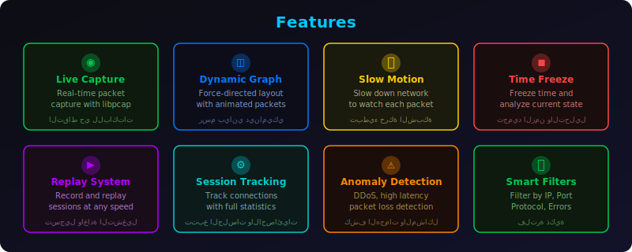
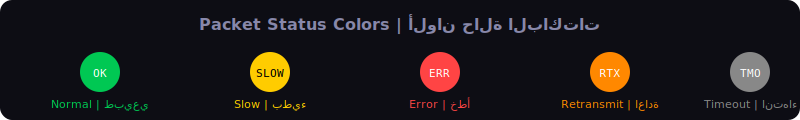
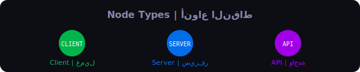

<p align="center">
  
</p>

<p align="center">
  
  
  
  
  
  
  
  
</p>

---

<div dir="rtl">

## نبذة عن المشروع

**NetVision** اداة تعرض حركة الشبكة بشكل بصري حي. كل باكت او طلب يظهر كجسم يتحرك بين النقاط (عملاء، سيرفرات، واجهات API). الاداة تعرض مسار الطلب بالكامل، زمن الانتقال، نقاط التأخير، واي اخطاء تحدث مع امكانية التفاعل مع كل عنصر لمعرفة التفاصيل التقنية.

</div>

## About

**NetVision** is a real-time network traffic visualization and analysis tool. Every packet or request is displayed as a moving object between nodes (clients, servers, APIs). The tool shows the complete request path, latency, delay points, and any errors with an interactive interface for inspecting technical details.

---

## Demo Video | فيديو العرض

[https://github.com/6x-u/NetVision/assets/](https://github.com/6x-u/NetVision/tree/main/assets)ms.mp4

<p align="center">
  <a href="assets/ms.mp4">
    
  </a>
</p>

---

## Features | المميزات

<p align="center">
  
</p>

<div dir="rtl">

| الميزة | الوصف |
|--------|-------|
| **التقاط حي** | التقاط الباكتات بشكل مباشر باستخدام libpcap مع ring buffer |
| **رسم بياني ديناميكي** | خريطة شبكة حية مع Force-Directed Layout |
| **حركة الباكتات** | كل باكت يتحرك بين النقاط بالوان تدل على حالته |
| **Slow Motion** | تبطيء الشبكة لمراقبة كل باكت |
| **Time Freeze** | تجميد الزمن لتحليل الحالة الحالية |
| **نظام Replay** | تسجيل واعادة تشغيل الجلسات بسرعة متغيرة |
| **تتبع الجلسات** | مراقبة كل اتصال مع احصائيات مفصلة |
| **فلترة ذكية** | فلترة حسب IP, Port, Protocol, Errors |
| **كشف المشاكل** | كشف DDoS, Latency عالي, Packet Loss |
| **تحليل Python** | تقارير تحليلية مع كشف الشذوذ |

</div>

| Feature | Description |
|---------|-------------|
| **Live Capture** | Real-time packet capture using libpcap with ring buffer |
| **Dynamic Graph** | Live network topology with Force-Directed Layout |
| **Packet Animation** | Each packet moves between nodes color-coded by status |
| **Slow Motion** | Slow down the network to watch each packet |
| **Time Freeze** | Freeze time and analyze the current state |
| **Replay System** | Record and replay sessions at variable speed (0.1x - 10x) |
| **Session Tracking** | Monitor every connection with detailed statistics |
| **Smart Filters** | Filter by IP, Port, Protocol, Errors |
| **Anomaly Detection** | Detect DDoS, high latency, packet loss |
| **Python Analysis** | Analytical reports with anomaly detection |

---

## Packet Status Colors | الوان حالة الباكتات

<p align="center">
  
</p>

---

## Node Types | انواع النقاط

<p align="center">
  
</p>

---

## Architecture | البنية

<p align="center">
  
</p>

```
NetVision/
├── include/              # Public headers (C/C++)
│   ├── nv_types.h        # Data structures and enums
│   ├── nv_capture.h      # Packet capture API
│   ├── nv_graph.h        # Graph management API
│   ├── nv_session.h      # Session tracking API
│   ├── nv_replay.h       # Replay system API
│   └── nv_engine.hpp     # C++ rendering engine
├── src/
│   ├── core/             # C - Packet capture, graph, sessions, replay
│   │   ├── nv_capture.c      # libpcap capture with ring buffer
│   │   ├── nv_graph.c        # Force-directed graph layout
│   │   ├── nv_session.c      # Connection session tracking
│   │   ├── nv_replay.c       # Record/save/load replay (.nvrp)
│   │   └── nv_main_cli.c     # CLI entry point
│   ├── engine/           # C++ - ImGui rendering engine
│   │   ├── nv_engine.cpp     # GLFW + OpenGL + ImGui
│   │   └── main.cpp          # GUI entry point
│   └── analysis/         # Python - Traffic analysis
│       ├── nv_analyzer.py    # Anomaly detection
│       ├── nv_pcap_reader.py # PCAP file parser
│       └── nv_cli.py         # CLI analysis tool
├── lib/imgui/            # ImGui (cloned from GitHub)
├── android/              # Android project
│   └── app/src/main/
│       ├── java/             # Java Activities
│       └── jni/              # JNI bridge (C)
├── assets/               # SVG diagrams and demo video
├── cmake/                # Cross-compilation toolchains
├── scripts/              # Build scripts (Linux/Windows/Android)
├── tests/                # Unit tests (C)
└── CMakeLists.txt        # Build system
```

---

## Languages | اللغات

| Component | Language | Purpose | الوظيفة |
|-----------|----------|---------|---------|
| **Core Library** | C | Packet capture, graph, sessions, replay | التقاط، رسم بياني، جلسات، اعادة |
| **Rendering Engine** | C++ | ImGui + GLFW + OpenGL visualization | محرك العرض البصري |
| **Analysis Module** | Python | Traffic analysis, anomaly detection | التحليل وكشف المشاكل |
| **Android App** | Java + C (JNI) | Mobile network visualization | تطبيق الموبايل |

---

## Build Targets | المنصات

| Platform | Output | Size |
|----------|--------|------|
| **Linux x86_64** | `netvision` (GUI) + `netvision-cli` + `libnvcore.so` | ~1 MB |
| **Windows x86_64** | `netvision.exe` + `nvcore.dll` + `nvcore.lib` | ~534 KB |
| **Android ARM32** | `libnvcore.so` + `libnetvision_jni.so` | ~18 KB |
| **Android ARM64** | `libnvcore.so` + `libnetvision_jni.so` | ~26 KB |
| **Android** | `NetVision.apk` (signed) | ~970 KB |

---

## Build Instructions | طريقة البناء

### Prerequisites | المتطلبات

**Linux:**
```bash
sudo apt install build-essential cmake libpcap-dev libglfw3-dev
git clone https://github.com/ocornut/imgui.git lib/imgui
```

**Windows (cross-compile from Linux):**
```bash
sudo apt install mingw-w64
```

**Android:**
- Download [Android NDK r26d](https://developer.android.com/ndk/downloads)
- Set `ANDROID_NDK` environment variable

---

### Linux Build
```bash
bash scripts/build_linux.sh
```

Or manually:
```bash
mkdir -p build/linux && cd build/linux
cmake ../.. -DCMAKE_BUILD_TYPE=Release
make -j$(nproc)
```

### Windows Build (cross-compilation)
```bash
bash scripts/build_windows.sh
```

### Android Build
```bash
export ANDROID_NDK=/path/to/android-ndk-r26d
bash scripts/build_android.sh
```

---

### Run | التشغيل

**GUI (requires sudo for capture):**
```bash
cd build/linux
sudo LD_LIBRARY_PATH=. ./netvision
```

**CLI Mode:**
```bash
cd build/linux
sudo LD_LIBRARY_PATH=. ./netvision-cli -d eth0 -c 100
```

**CLI Options:**
```
-l              List available network devices
-d <device>     Capture device (default: first available)
-c <count>      Max packets to capture (default: 100)
-r <file.nvrp>  Load and replay a capture file
```

**Fullscreen Mode:**
```bash
NV_FULLSCREEN=1 sudo -E LD_LIBRARY_PATH=. ./netvision
```

---

### Run Tests | تشغيل الاختبارات

```bash
cd build/linux
LD_LIBRARY_PATH=. ./nv_test_graph      # 7 tests
LD_LIBRARY_PATH=. ./nv_test_session    # 5 tests
LD_LIBRARY_PATH=. ./nv_test_replay     # 5 tests
```

**Total: 17 tests**

---

### Python Analysis | تحليل Python

```bash
python3 -m src.analysis.nv_cli capture.pcap -o report.txt --top 20 --threshold 500
```

```
Options:
  pcap_file          PCAP file to analyze
  -o, --output       Output report file
  --top N            Top N talkers (default: 10)
  --threshold MS     Latency threshold in ms (default: 1000)
```

---

## CMake Options

| Option | Default | Description | الوصف |
|--------|---------|-------------|-------|
| `NV_BUILD_SHARED` | ON | Build shared library (.so/.dll) | بناء مكتبة مشتركة |
| `NV_BUILD_TESTS` | ON | Build unit tests | بناء الاختبارات |
| `NV_HEADLESS` | OFF | Build without GUI | بناء بدون واجهة |
| `NV_ANDROID` | OFF | Build for Android | بناء لاندرويد |
| `NV_USE_STUB_CAPTURE` | OFF | Use stub capture (no libpcap) | بدون libpcap |

---

## Supported Protocols | البروتوكولات المدعومة

| Protocol | Detection |
|----------|-----------|
| **TCP** | Full connection tracking |
| **UDP** | Datagram capture |
| **HTTP** | Port 80 + payload detection |
| **HTTPS** | Port 443 (metadata only) |
| **DNS** | Port 53 query/response |
| **ICMP** | Ping and error messages |
| **ARP** | Address resolution |

---

## Dependencies

| Library | Purpose | Required |
|---------|---------|----------|
| **libpcap** | Packet capture | Linux (live capture) |
| **GLFW3** | Window management | Desktop GUI builds |
| **OpenGL 3.0+** | Rendering | Desktop GUI builds |
| **ImGui** | Immediate mode GUI | Included in `lib/` |
| **Android NDK** | Native Android builds | Android only |

---

## Windows Notes

The Windows build produces `nvcore.dll` and `nvcore.lib`. For full packet capture on Windows, install [Npcap](https://npcap.com/) and link against the [Npcap SDK](https://npcap.com/dist/npcap-sdk-1.13.zip), then replace the stub capture implementation.

---

<div dir="rtl">

## ملاحظات

- الاداة تحتاج صلاحيات root/sudo لالتقاط الباكتات على Linux
- على Windows تحتاج تشغيلها كـ Administrator
- على Android تحتاج صلاحية INTERNET و ACCESS_NETWORK_STATE
- ملف ImGui يتم سحبه من GitHub ولا يتم تضمينه بالريبو
- جميع الكلاسات والكود من كتابة المطور MERO:TG@QP4RM

</div>

---

<p align="center">
  <b>Developer: MERO:TG@QP4RM</b>
</p>
